# Honeycomb + AWS Workshop

## Observe and Debug Modern Systems — from Microservices to AI Agents

Welcome! Over the next four modules you will deploy a real microservices application on Amazon EKS, instrument it for Honeycomb, investigate production-style latency two ways — first yourself, then with an AI agent — and finish by building and instrumenting your **own** AI agent and watching it light up Honeycomb's Agent Timeline.

| # | Module | What you walk away with |
|---|---|---|
| 1 | Deploy the OpenTelemetry Demo + connect it to Honeycomb | A working microservices app streaming traces to your own Honeycomb environment |
| 2 | Investigate in Honeycomb | A real latency finding, discovered with BubbleUp, traces, and Canvas |
| 3 | AWS DevOps Agent + Honeycomb MCP | An AI investigation that goes from "I can't see inside your app" to application-level root cause — and a clear understanding of why |
| 4 | Build + instrument a Strands agent | A fully-populated Agent Timeline from ~60 lines of code you can read top to bottom |

TL,DR: **observability is what turns both humans and AI agents into effective investigators.** Every module makes that point a different way.

### Prerequisites

- An AWS account with CloudShell access and permissions for EKS, IAM, Bedrock, and AWS DevOps Agent (`aidevops:*`, `iam:CreateRole`). All commands in this guide run in **AWS CloudShell** in **us-west-2**.
- A **free Honeycomb account** — sign up at [honeycomb.io/signup](https://www.honeycomb.io/signup) if you haven't. The free tier includes everything this workshop uses, including Honeycomb MCP.

### Get the workshop assets

Multi-line pastes into CloudShell can mangle whitespace and quotes, so all files you need ship in this repository. Clone it into your CloudShell home directory first:

```bash
cd ~
git clone https://github.com/honeycombio/aws-workshop.git
```

Everything the guide references lives under `~/aws-workshop/artifacts/`.

---

## Module 1 — Deploy the app and connect it to Honeycomb

You'll stand up the OpenTelemetry Demo — a "telescope shop" of a dozen-plus microservices, complete with a load generator and a self-hosted LLM behind its product-review features — then reconfigure its bundled OpenTelemetry Collector to export telemetry to Honeycomb. No application code changes required: that's the point of the collector.

> **Workshop Studio note:** in the event build, the cluster is provisioned for you by CloudFormation and this module reduces to `aws eks update-kubeconfig` plus the Honeycomb wiring. The full path is included here so you can reproduce everything in your own account later.

### 1.1 Install tooling

CloudShell ships with `aws` and `kubectl`. Install `eksctl`:

```bash
curl --silent --location "https://github.com/eksctl-io/eksctl/releases/latest/download/eksctl_$(uname -s)_amd64.tar.gz" | tar xz -C /tmp
sudo mv /tmp/eksctl /usr/local/bin
eksctl version
```

Install `helm` if it isn't already present:

```bash
curl https://raw.githubusercontent.com/helm/helm/main/scripts/get-helm-3 | bash
helm version
```

### 1.2 Provision the EKS cluster

The demo needs Kubernetes 1.24+ and about 6 GB of free memory; a single `m5.xlarge` (16 GB) node covers it. Provisioning takes about 15 minutes — a good moment to do the Honeycomb signup if you haven't.

```bash
eksctl create cluster \
  --name otel-demo \
  --region us-west-2 \
  --nodes 1 \
  --node-type m5.xlarge \
  --managed
```

`eksctl` writes your kubeconfig automatically. Verify you can reach the cluster:

```bash
kubectl get nodes
```

### 1.3 Install the OpenTelemetry Demo

```bash
helm repo add open-telemetry https://open-telemetry.github.io/opentelemetry-helm-charts
helm repo update
helm install my-otel-demo open-telemetry/opentelemetry-demo
```

Watch the pods come up, and press Ctrl-C once everything is `Running`:

```bash
kubectl get pods -w
```

The bundled load generator starts producing realistic traffic immediately — you don't need to do anything to generate trace volume.

### 1.4 Access the application

CloudShell has no port preview, so expose the frontend through a LoadBalancer — which is also the realistic way to reach it:

```bash
kubectl patch svc frontend-proxy -p '{"spec":{"type":"LoadBalancer"}}'
kubectl get svc frontend-proxy -w
```

Wait for an `EXTERNAL-IP` to appear (Ctrl-C once it does), then browse to these, replacing `<elb-dns>` with that value:

| UI | URL |
|---|---|
| Web store | `http://<elb-dns>:8080/` |
| Grafana | `http://<elb-dns>:8080/grafana/` |
| Jaeger | `http://<elb-dns>:8080/jaeger/ui/` |
| Load generator | `http://<elb-dns>:8080/loadgen/` |
| Feature flags (flagd) | `http://<elb-dns>:8080/feature` |

Click around the shop. Notice the demo already ships an *in-cluster* observability stack (Jaeger, Prometheus, Grafana, OpenSearch). Keep that in mind — we're about to add Honeycomb *alongside* it, not replace it, and in Module 3 the difference between "telemetry trapped in the cluster" and "telemetry an agent can reach" becomes the whole story.

### 1.5 Inspect the collector before touching it

Chart internals drift between versions, so discover the collector's actual names rather than trusting any guide — including this one:

```bash
kubectl get configmap | grep -i otel
kubectl get deploy,ds,sts -A | grep -i otel
```

Then look at the pipelines the collector is currently running, substituting the configmap name you just found:

```bash
kubectl get configmap <configmap-name> -o yaml | grep -A 60 "pipelines:"
```

At the time this guide was validated, the configmap was `otel-collector-agent`, the workload was `daemonset.apps/otel-collector-agent`, and the pipelines exported traces to `otlp/jaeger`, metrics to `otlphttp/prometheus`, and logs to `opensearch` (each alongside `debug` and `spanmetrics`). If your names differ, substitute yours in the commands below.

**Why this matters:** the collector is a pipeline router — receivers in, processors in the middle, exporters out. Adding a backend is adding one exporter and referencing it in the pipelines. That's the entire integration.

### 1.6 Create the Honeycomb ingest key and secret

In Honeycomb: **Environment Settings → API Keys → Create Ingest Key**. Copy the key, then store it in the cluster as a secret:

```bash
export HONEYCOMB_API_KEY=<your-ingest-key>
kubectl create secret generic honeycomb-credentials \
  --from-literal=HONEYCOMB_API_KEY="$HONEYCOMB_API_KEY"
```

Make sure this is an **ingest** key. Honeycomb also has management keys — you'll create one of those in Module 3 for a different purpose, and mixing them up is the most common failure mode in this workshop.

### 1.7 Add Honeycomb as an exporter

The values override ships in the repo at `artifacts/honeycomb-values.yaml`:

```yaml
opentelemetry-collector:
  extraEnvsFrom:
    - secretRef:
        name: honeycomb-credentials
  config:
    exporters:
      otlp/honeycomb:
        endpoint: "api.honeycomb.io:443"
        headers:
          "x-honeycomb-team": "${env:HONEYCOMB_API_KEY}"
    service:
      pipelines:
        traces:
          exporters: [otlp/jaeger, debug, spanmetrics, otlp/honeycomb]
        metrics:
          exporters: [otlphttp/prometheus, debug, otlp/honeycomb]
        logs:
          exporters: [opensearch, debug, otlp/honeycomb]
```

Two details worth absorbing before you apply it:

1. **The `x-honeycomb-team` header is the entire auth contract.** Anything that can speak OTLP and set that header can send data to Honeycomb — a collector, an SDK, or (in Module 4) your own agent. EU accounts use `api.eu1.honeycomb.io:443`.
2. **The exporter lists are replaced by Helm's merge, not appended.** That's why each pipeline restates the existing exporters alongside `otlp/honeycomb` — omit them and you'd silently disconnect Jaeger, Prometheus, and OpenSearch.

Apply it and watch the rollout, substituting your workload name if it differs:

```bash
helm upgrade my-otel-demo open-telemetry/opentelemetry-demo --values ~/aws-workshop/artifacts/honeycomb-values.yaml
kubectl rollout status daemonset/otel-collector-agent
```

### 1.8 Verify data is flowing

```bash
kubectl logs -l app.kubernetes.io/name=opentelemetry-collector -f --tail=50
```

You're looking for the *absence* of `401`, `permission denied`, or `connection refused`. Then open Honeycomb → **Datasets**: within about 30 seconds you should see new datasets appear, one per service (`frontend`, `cart`, `checkout`, `frontend-proxy`, ...). Dataset routing follows `service.name` — remember that; it comes back in Module 4.

**Module 1 takeaway:** adding an observability backend to an OTel-instrumented system is one exporter block and one line per pipeline. The app never knew anything changed.

---

## Module 2 — Investigate in Honeycomb

The demo has a latency story hiding in plain sight — no chaos flags, no injected faults, just the organic behavior of a service that makes sequential LLM calls. You're going to find it the way you would in production: query, spot the outliers, ask what makes them different.

### 2.1 Query the request distribution

In Honeycomb, go to **Query** and select the `frontend-proxy` dataset — it's the front door all requests pass through. Build this query:

- **VISUALIZE**: `HEATMAP(duration_ms)`
- **WHERE**: `trace.span_id exists`

Run it over the last 30 minutes. A heatmap shows the full latency *distribution* over time, not a single averaged line — most traffic hugs the bottom, and distinct slow bands sit above it. Averages would have hidden exactly what you're about to investigate.

### 2.2 From distribution to a single trace

Right-click any dense region of the heatmap and choose **View trace**:

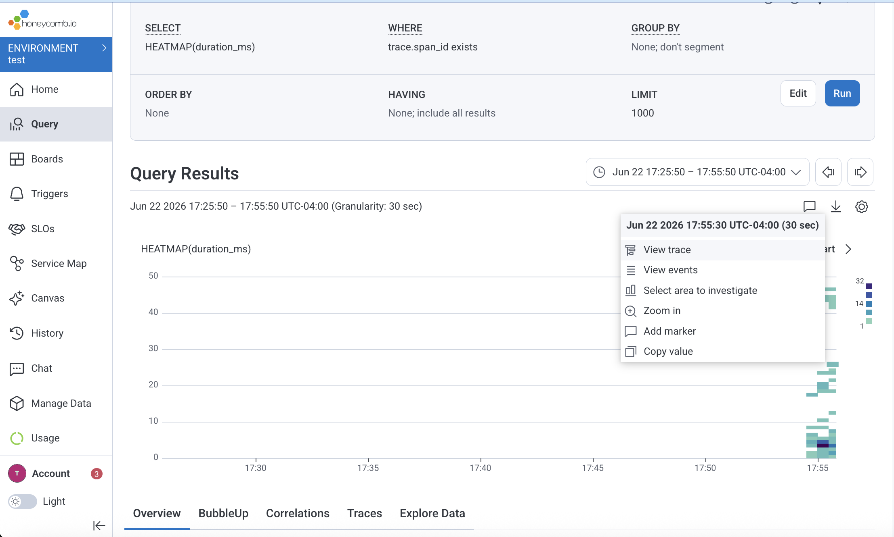

You land in the trace waterfall — one request, every span, across every service it touched:

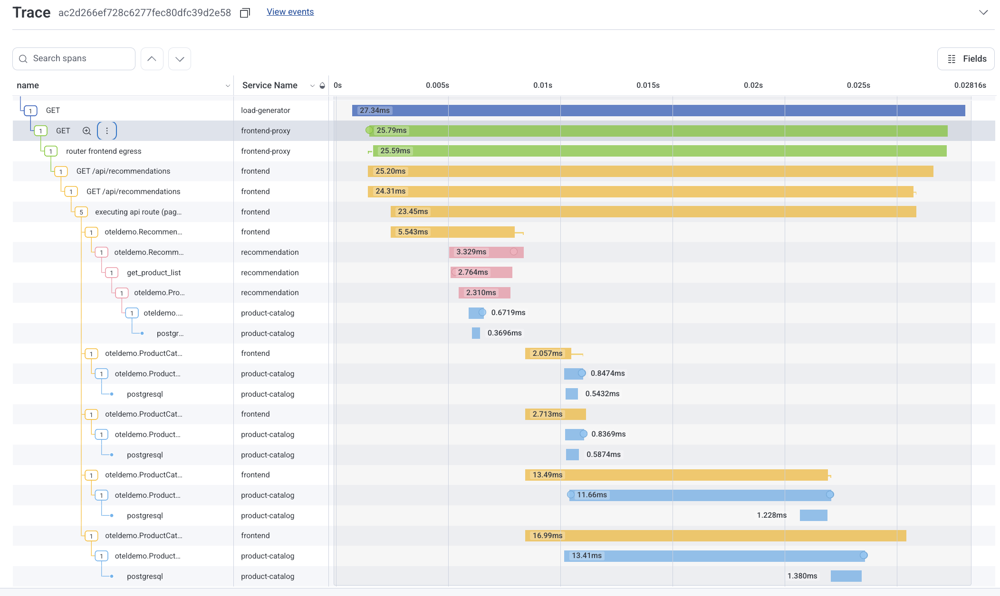

Walk the tree: `load-generator → frontend-proxy → frontend → recommendation → product-catalog → postgresql`. Click a span and inspect its fields — `http.url`, `user_agent.original`, timing, status. Each span carries dozens of attributes, and every one of them is queryable. That's the raw material BubbleUp is about to exploit.

### 2.3 BubbleUp: ask what's *different* about the slow requests

Back on the query results, open the **BubbleUp** tab and drag a box around the slowest band of the heatmap. BubbleUp compares everything inside your selection against everything outside and ranks the attributes that differ most:

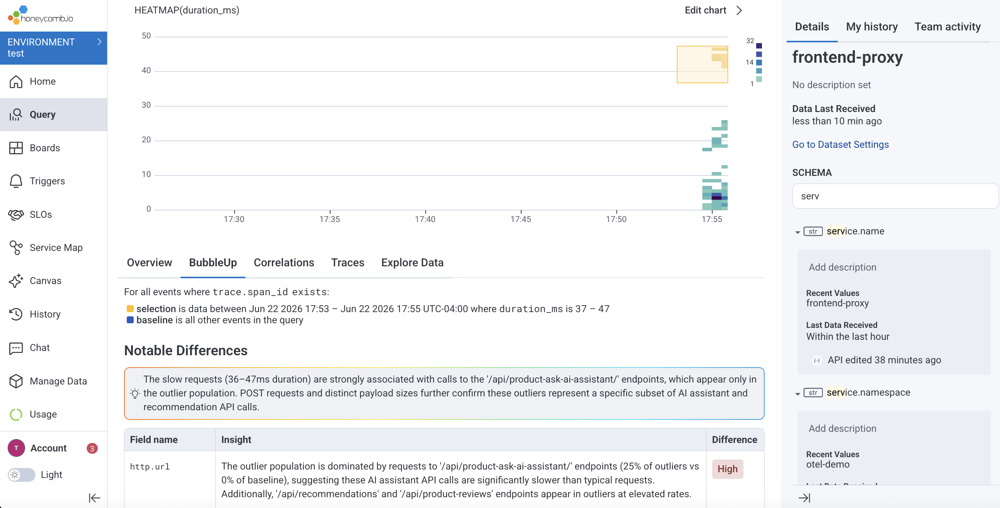

With the top band selected (37–47ms in the validated run), the answer jumps out: slow requests are dominated by `/api/product-ask-ai-assistant/` — the demo's LLM-backed endpoint — appearing in ~25% of outliers and 0% of the baseline.

Select the middle band and you get a different, equally crisp story: `/api/recommendations` and `/api/product-reviews` own that tier of latency:

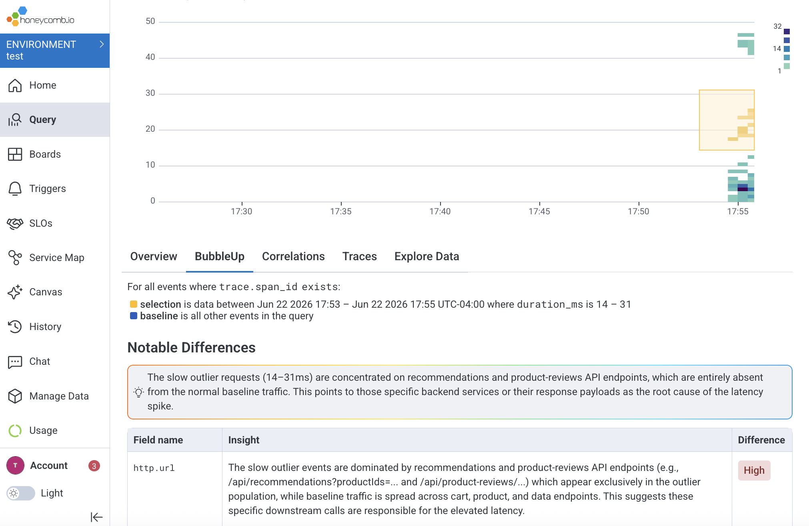

Notice what you did *not* do: write a query hypothesizing about AI endpoints, or pre-register `http.url` as a metric label. BubbleUp surfaced the differentiating attribute from high-cardinality trace data on demand. In a metrics system, a label like URL-with-query-params would be a cardinality explosion; here it's just another column.

### 2.4 Investigate in Canvas

Open any interesting trace, click the ⋮ menu on a span, and choose **Investigate in Canvas**:

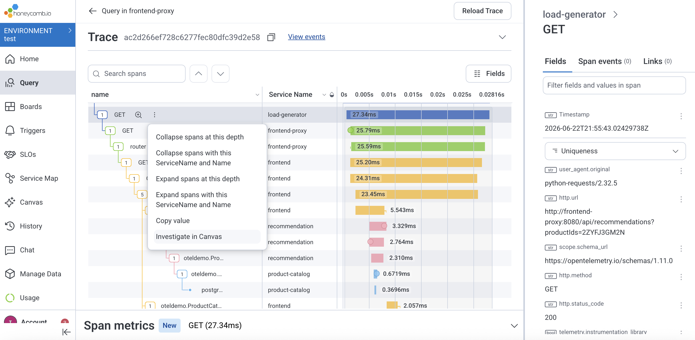

Canvas is an AI-assisted investigation surface: it pulls the trace, the queries, and BubbleUp comparisons into one board and reasons over them with you. In the validated run, it characterized the recommendation path's bimodal latency (`get_product_list` P50 0.78ms vs P95 13.2ms), ran its own BubbleUp, and isolated the slow tail to a single backend instance — findings pinned with evidence you can share:

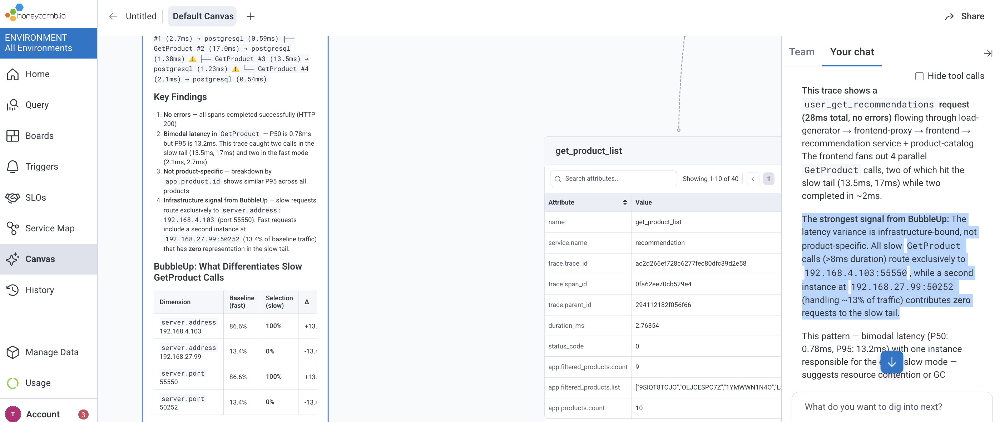

Your data will tell its own variant of this story — follow where it leads and ask Canvas follow-up questions.

**Module 2 takeaway:** you went from "some requests are slow" to *which endpoint, which tier, and what differentiates them* in a handful of clicks — no query language memorized, no dashboards pre-built, no cardinality budget. Keep this investigation in mind: in the next module an AI agent attempts the same one.

---

## Module 3 — AI-augmented investigation: AWS DevOps Agent + Honeycomb MCP

Now hand the same investigation to an AI. You'll provision the AWS DevOps Agent, ask it to investigate the frontend-proxy latency **without** any access to your traces, and watch it hit a wall — articulately. Then you'll connect Honeycomb via MCP and watch the same investigation reach application-level root cause. The before/after is the lesson: an agent is only as good as the telemetry it can reach.

### 3.1 Create an Agent Space

In the AWS console, search for **DevOps Agent** and open **Agent Spaces → Create Agent Space**:

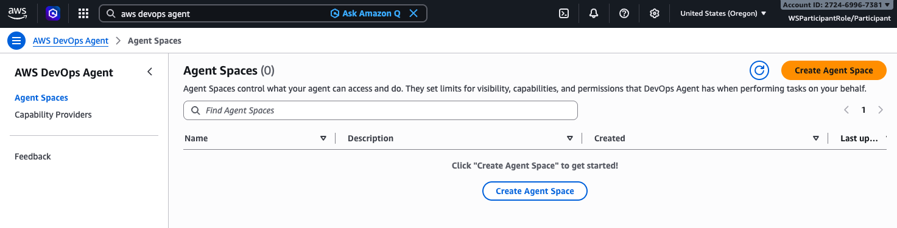

In the wizard, let it **auto-create the service IAM role** (one click), and **enable the Web App** — that's the chat UI you'll use throughout this module. When creation finishes, open the agent UI via **Operator access** on the Agent Space page.

Optionally, sanity-check what the role can see:

```bash
aws iam list-roles --query 'Roles[?contains(RoleName, `DevOpsAgent`)].RoleName'
aws iam list-attached-role-policies --role-name <role-name>
```

The role gets read access to EKS, CloudWatch Logs, EC2, and X-Ray — infrastructure surfaces. Note what's *not* in that list: your Kubernetes API, your application logs, your traces.

### 3.2 Baseline: investigate without observability

Run these three prompts in order in the agent chat, escalating from sanity check to full investigation.

First, confirm the account association:

> *tell me about what's deployed*

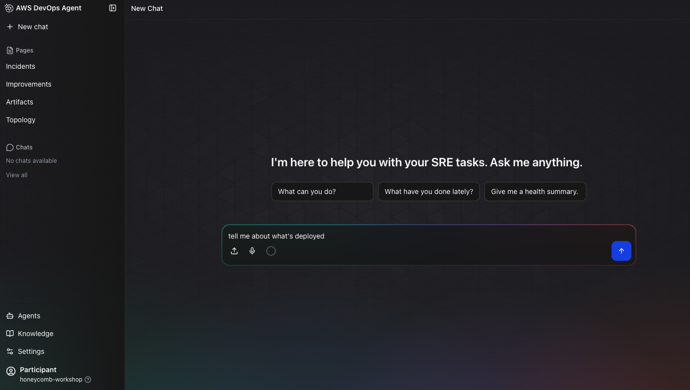

Second, confirm it can read cluster topology:

> *describe the EKS cluster otel-demo*

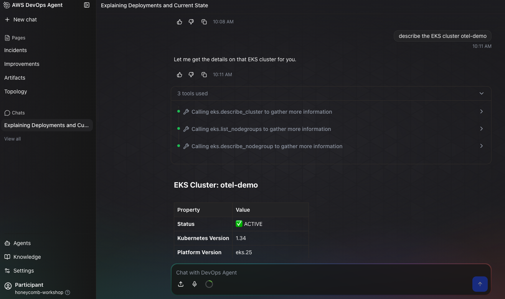

Watch the tool calls it makes (`eks.describe_cluster`, `eks.list_nodegroups`, ...) — it's reading AWS APIs, not the cluster's insides. It will likely also flag the public API endpoint and disabled control-plane logging; reasonable observations for a dev cluster.

Third, kick off the real investigation:

> *Investigate latency on the frontend-proxy service*

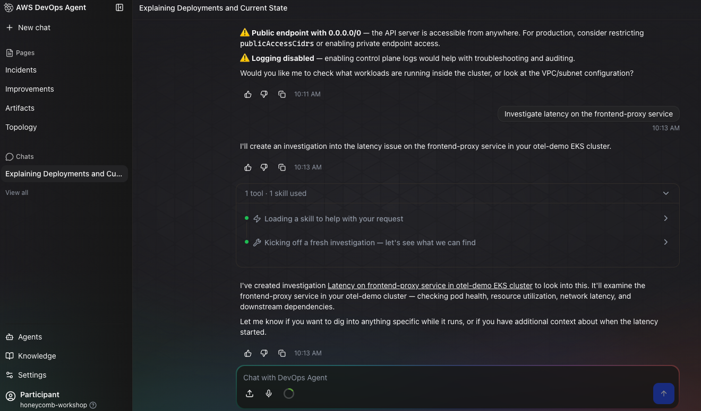

This launches a formal, multi-subagent investigation — click the investigation link to watch it work in real time. Expect roughly 8–10 minutes; narrate-worthy moments as you watch:

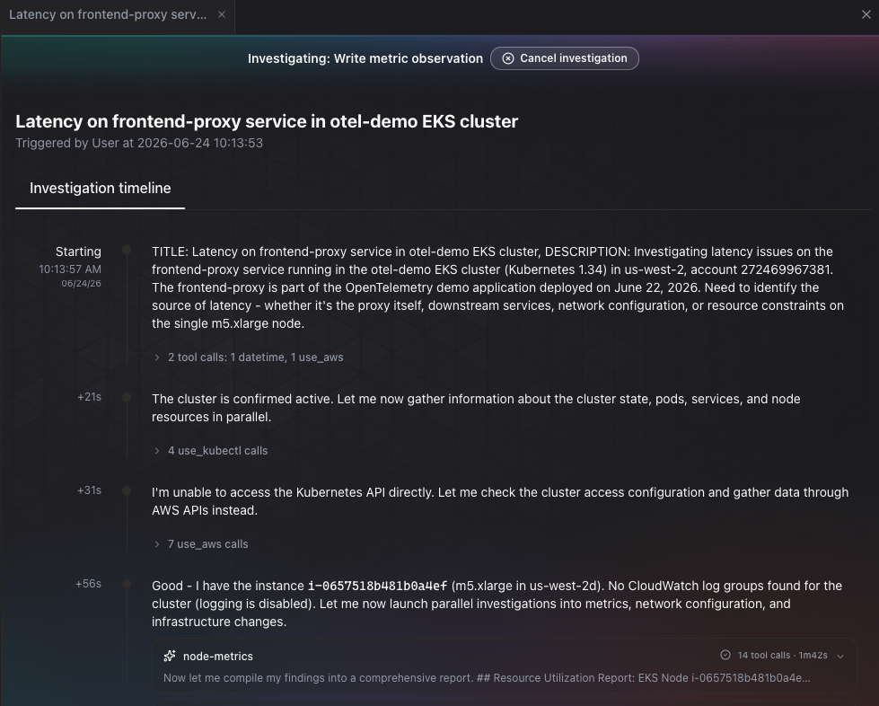

It tries `kubectl`, gets denied (its IAM role has no EKS access entry), and pivots to AWS APIs. It spawns parallel subagents for node metrics, network config, and infrastructure changes — then goes looking for traces:

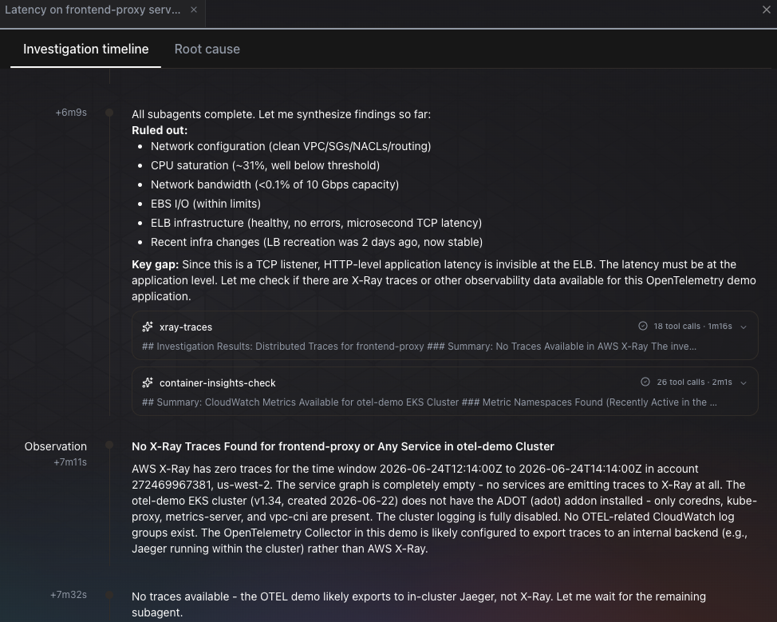

The synthesis is genuinely good infrastructure work: it rules out CPU (~31%), network, EBS, ELB health, and recent infra changes, and correctly reasons that the latency must be at the application level. Then it checks X-Ray: **zero traces** — this app exports to an in-cluster Jaeger it cannot reach.

### 3.3 Read the baseline root cause — especially the gaps

When the investigation completes, open the **Root cause** tab:

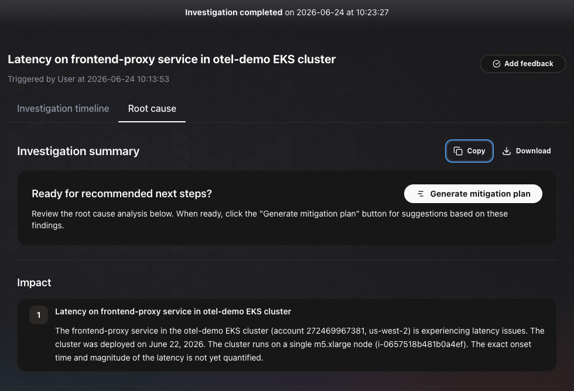

Without application visibility, the agent can only offer *hypotheses* — memory pressure, downstream latency, CPU throttling — each carefully hedged:

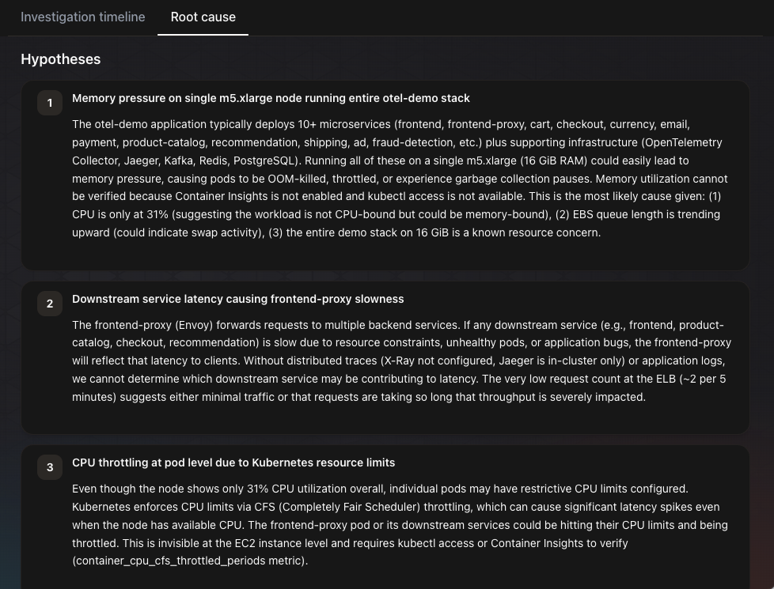

And then the most instructive part — it names exactly what it's missing:

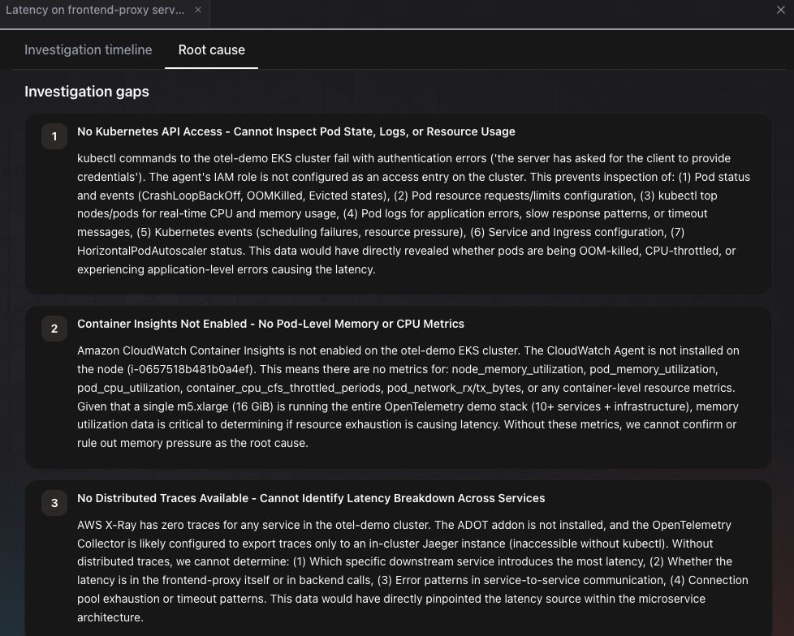

Four distinct visibility gaps, each closeable by a different mechanism:

| Gap | Closed by |
|---|---|
| No kubectl access | EKS access entry for the agent's role |
| No pod-level metrics | CloudWatch Container Insights |
| No application logs in CloudWatch | EKS logging + CloudWatch agent |
| **No distributed traces** | **Honeycomb MCP** |

We're going to close *only* the last one — and it turns out to be the one that matters.

### 3.4 Create a Honeycomb management API key

Honeycomb MCP authenticates with a **management** key (not the ingest key from Module 1). In Honeycomb: **Account → Team Settings → API Keys → Create Management API Key**. Scope it to **Model Context Protocol: Read-only** and **Environments: Read-only**:

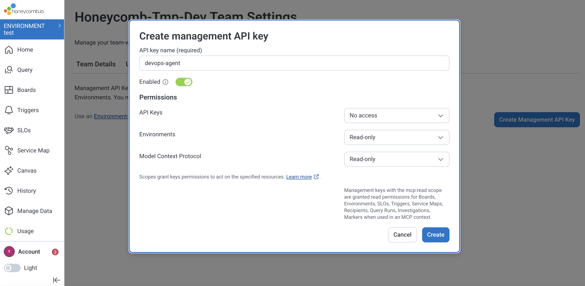

Copy both the **Key ID** and **Key Secret** — they're shown only once, and you need both halves in the next step.

### 3.5 Register Honeycomb MCP with the agent

On your Agent Space page, find the **MCP Server** section and click **Add**:

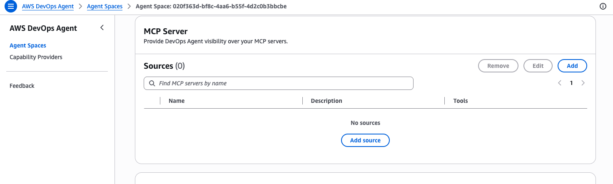

In the capability dialog, choose **New MCP Server Registration → Register**:

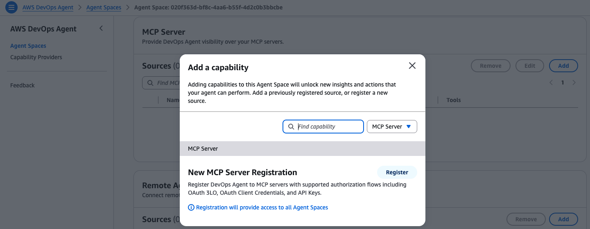

The four-step wizard is where everyone gets burned by the auth fields, so match these screenshots closely.

**Step 1 — Server details.** Name it `honeycomb`, endpoint `https://mcp.honeycomb.io/mcp` (EU: `https://mcp.eu1.honeycomb.io/mcp`):

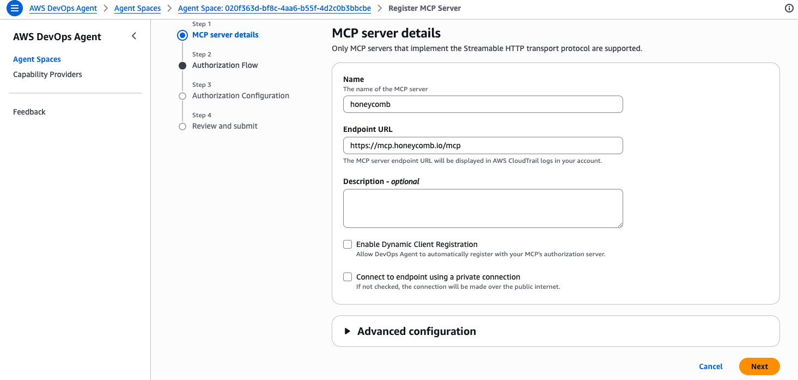

**Step 2 — Authorization flow.** Select **API Key**:

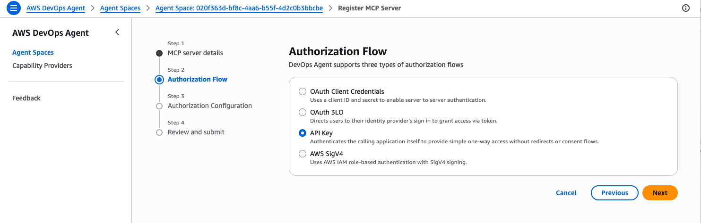

**Step 3 — Authorization configuration.** This is the trap:

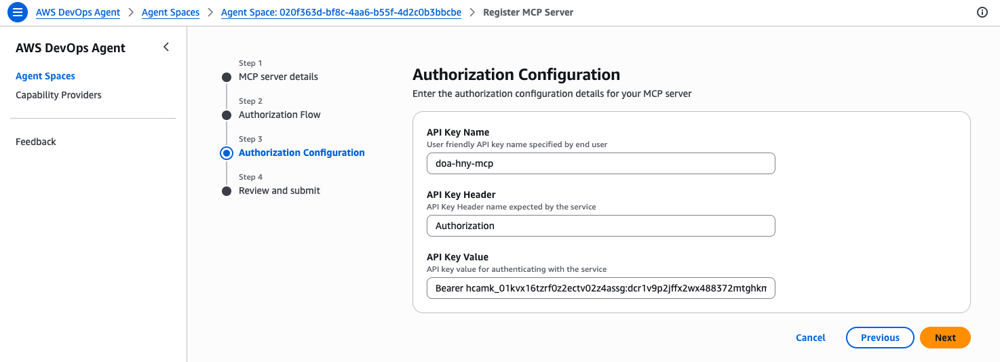

| Field | What goes in it |
|---|---|
| API Key Name | Any friendly label, e.g. `doa-hny-mcp` |
| API Key Header | `Authorization` — the header **name only** |
| API Key Value | `Bearer KEY_ID:SECRET_KEY` — the word `Bearer`, a space, then Key ID and Key Secret **joined with a colon** |

Read that table twice. The failure modes are all silent or cryptic:

1. Pasting `Authorization: Bearer xxx` into the header field throws "Invalid input" — the field wants the header *name* only.
2. Using just the Key ID (or just the secret) authenticates against nothing — the value needs **both halves joined with `:`**.
3. The `Bearer ` prefix (with its trailing space) belongs in the value field.
4. Any stray whitespace or quotes in either field fails silently.

**Step 4 — Review and submit.** After registration, you're asked which of the server's tools to enable — the workshop uses queries, traces, and BubbleUp analysis, so select all of them:

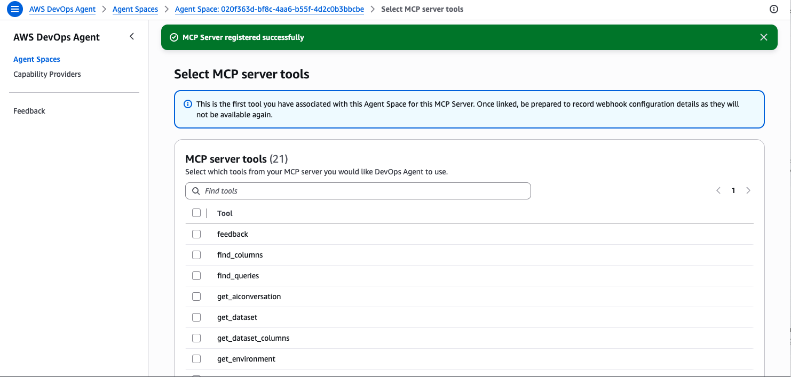

On the confirmation page you'll also see a webhook configuration — that's for event-driven integrations we're not using today; you can close it:

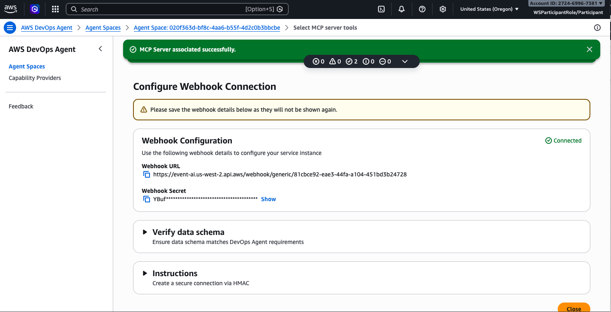

### 3.6 Verify, then re-investigate

Back in the agent chat, confirm the wiring:

> *which MCP servers / tools do you have access to?*

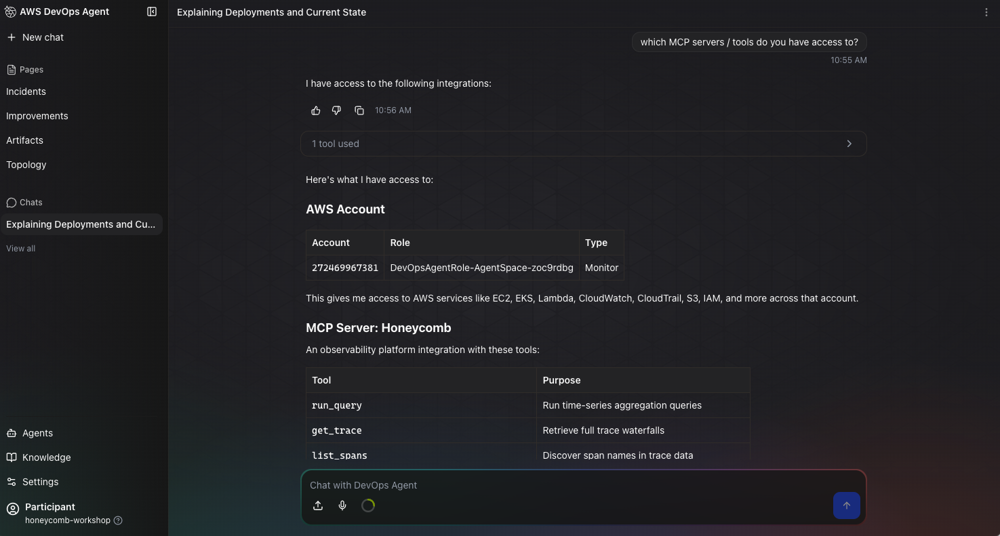

A real tool listing (`run_query`, `get_trace`, `list_spans`, ...) confirms auth end to end. Note the agent's own observation: since the cluster is OTel-instrumented, it can now query traces directly. Take it up on that:

> *can you re-open the previous investigation and cross examine with Honeycomb data?*

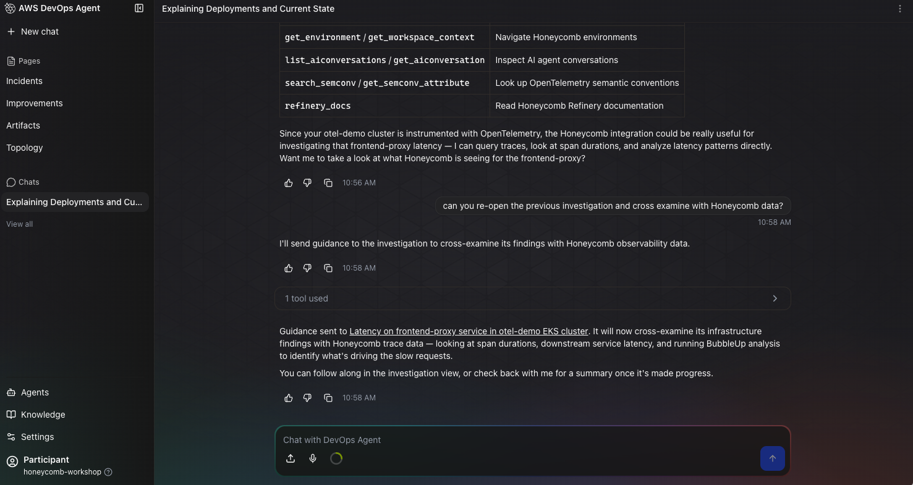

The agent sends guidance to the existing investigation, which resumes — now with trace access. Follow along in the investigation view, then open the updated **Root cause** (note the version selector — v2):

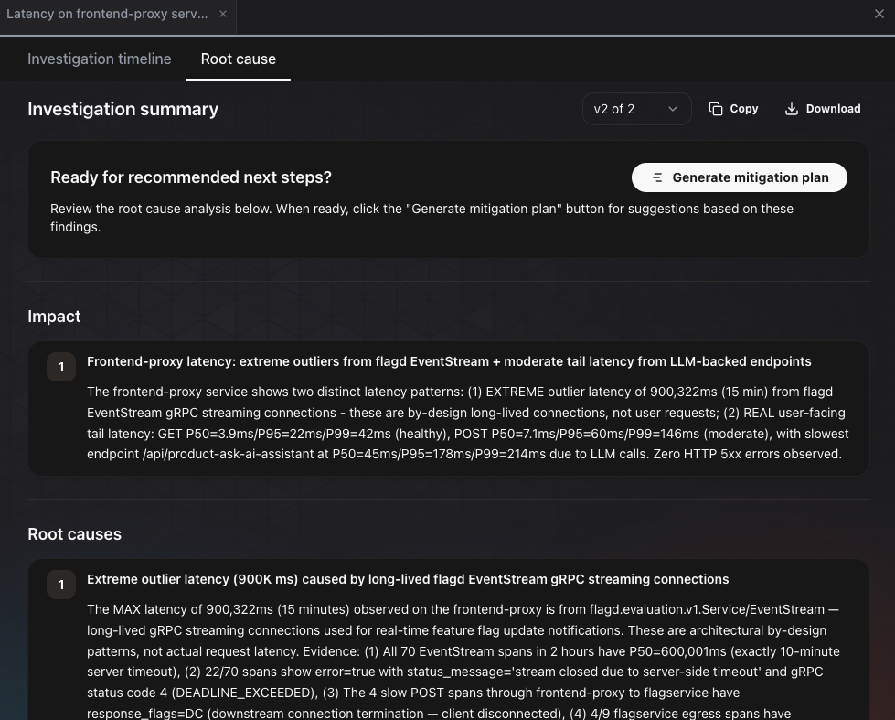

Compare this against the baseline, because the difference is the whole module:

- The scary 900,000ms "latency" is correctly diagnosed as **flagd EventStream long-lived gRPC connections** — architectural, by design, not user-facing at all. Infrastructure metrics alone could never have made that distinction.
- The *real* tail latency is `/api/product-ask-ai-assistant` (P50 45ms / P95 178ms / P99 214ms) — the same sequential-LLM-call endpoint **you** found with BubbleUp in Module 2.
- Per-endpoint percentile breakdowns, zero "cannot determine" gap blocks.

Full verbatim transcripts of both runs ship in this repo: [baseline](artifacts/module-3-baseline-investigation.md) and [with MCP](artifacts/module-3-mcp-augmented-investigation.md).

**Module 3 takeaway:** the agent didn't get smarter between the two runs — it got *access to traces*. The same MCP server that powers Honeycomb's own AI features made a third-party agent capable of application-level root cause. Observability is the substrate AI investigation runs on.

---

## Module 4 — Build and observe your own agent

You've *used* an AWS agent; now build one. You'll run a minimal AWS Strands agent in CloudShell — Bedrock-backed, two tools, ~60 readable lines — instrumented with OpenTelemetry GenAI semantic conventions and exporting **directly to Honeycomb**. No collector, no sidecar, no transform. The payoff is a fully-populated Agent Timeline: conversation grouping, chat and tool-call spans, and a role-labeled Messages panel.

### 4.1 Set up the environment

CloudShell's default `python3` meets the requirement (3.10+). Create a venv and install Strands **with the `[otel]` extra**:

```bash
python3 -m venv ~/strands-venv
source ~/strands-venv/bin/activate
pip install 'strands-agents[otel]'
```

The extra is not optional: the base package omits the OTLP exporter, and the telemetry bootstrap fails at runtime with `ModuleNotFoundError: opentelemetry.exporter...` — a confusing error to hit ten steps from where you caused it.

### 4.2 Read the agent

The script ships at `artifacts/agent.py` — don't paste it, read it. This is the entire agent:

```python
import uuid
from datetime import datetime, timezone

from strands import Agent, tool
from strands.telemetry import StrandsTelemetry

StrandsTelemetry().setup_otlp_exporter()


@tool
def current_time() -> str:
    """Returns the current UTC time in ISO 8601 format."""
    return datetime.now(timezone.utc).isoformat()


@tool
def word_count(text: str) -> int:
    """Counts the number of words in the provided text."""
    return len(text.split())


session_id = str(uuid.uuid4())

agent = Agent(
    model="us.anthropic.claude-haiku-4-5-20251001-v1:0",
    tools=[current_time, word_count],
    system_prompt="You are a concise workshop assistant. Use your tools when asked about the time or word counts.",
    trace_attributes={
        "gen_ai.conversation.id": session_id,
        "gen_ai.agent.name": "workshop-agent",
    },
)

print(f"conversation id: {session_id}")
while True:
    try:
        user_input = input("\nyou> ")
    except EOFError:
        break
    if user_input.strip().lower() in ("exit", "quit"):
        break
    agent(user_input)
```

What to notice:

- **The instrumentation is three readable lines.** `StrandsTelemetry().setup_otlp_exporter()` plus the two `trace_attributes` — `gen_ai.conversation.id` (groups every turn of a session) and `gen_ai.agent.name` (labels the timeline lane). Strands emits the rest of the GenAI semantic conventions — `invoke_agent`/`chat`/`execute_tool` spans, model names, token counts — natively. No magic sidecar; the telemetry story is *in the code you can see*.
- **The `@tool` docstrings are load-bearing.** They become the tool descriptions the model reasons over, and the tool spans in Honeycomb will carry each call's arguments and results.
- **The model is Bedrock Haiku 4.5** via the `us.anthropic.claude-haiku-4-5-20251001-v1:0` inference profile — fast and cheap enough that everyone can hammer it.

### 4.3 Configure export to Honeycomb

Set your ingest key first — the same **ingest** key from Module 1, not the management key from Module 3:

```bash
export HONEYCOMB_API_KEY=<your-ingest-key>
```

Then the OTel environment variables. This is the whole "pipeline" — compare it to the collector work in Module 1:

```bash
export OTEL_EXPORTER_OTLP_ENDPOINT=https://api.honeycomb.io
export OTEL_EXPORTER_OTLP_HEADERS=x-honeycomb-team=$HONEYCOMB_API_KEY
export OTEL_EXPORTER_OTLP_PROTOCOL=http/protobuf
export OTEL_RESOURCE_ATTRIBUTES=service.name=strands-workshop-agent
export OTEL_SEMCONV_STABILITY_OPT_IN=gen_ai_latest_experimental,gen_ai_span_attributes_only
```

That last line is **load-bearing**: without the `gen_ai_span_attributes_only` token, Strands records message content as span *events*, which the Agent Timeline Messages panel doesn't render — your timeline would populate but every conversation would look empty. With it, prompts and responses land as span attributes and render fully.

CloudShell already provides AWS credentials and region for Bedrock — nothing else to configure.

### 4.4 Run it

```bash
source ~/strands-venv/bin/activate
python ~/aws-workshop/artifacts/agent.py
```

The script prints its conversation id — note it, it's your search key in Honeycomb. Then have a short conversation designed to exercise each span type:

1. *What time is it right now?* — forces a `current_time` tool call.
2. *How many words are in this sentence: observability makes on-call humane again* — forces `word_count` with arguments.
3. *Summarize what tools you have.* — a pure chat turn, no tool.

Type `exit` when done.

### 4.5 Explore the Agent Timeline

In Honeycomb, open **Agent Timeline** from the main navigation and find your conversation — browse recent conversations or search by the printed conversation id:

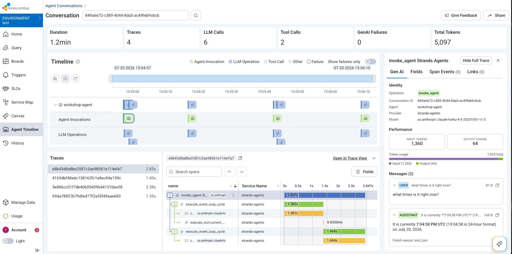

Work through it top to bottom, connecting everything back to the code you just read:

1. **The conversation header** aggregates the whole session — duration, traces, LLM calls, tool calls, total tokens. Every turn grouped together because the script set the session UUID as `gen_ai.conversation.id`.
2. **The timeline** shows a `workshop-agent` lane — named by `gen_ai.agent.name` — with one `invoke_agent` span per turn, nested `chat` spans, and `execute_tool` spans.
3. **The Gen AI tab on an `invoke_agent` span** shows identity (agent, provider, model), token performance, and the **Messages panel with role-labeled user and assistant turns** — this is `gen_ai.input/output.messages` rendered from span attributes, the payoff of that `OTEL_SEMCONV_STABILITY_OPT_IN` line.

Click into a `chat` span from a turn that used a tool:

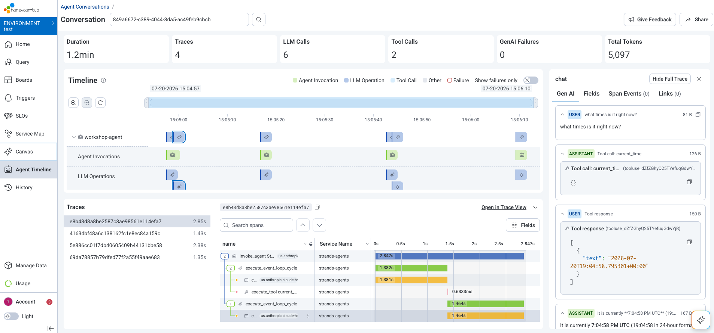

4. **Tool calls render with their arguments and results** — there's the `current_time` call and the ISO-8601 timestamp it returned, exactly what the `@tool` function produced.
5. Optionally, open **Traces view** below the timeline for the same data as a raw span waterfall. Agent Timeline is a *lens* over ordinary OpenTelemetry traces — not a separate pipeline, not a proprietary format.

Finally, check **Datasets**: a new `strands-workshop-agent` dataset exists, routed by `service.name` exactly like the demo services in Module 1. Your hand-built agent and a 20-service production stack land in Honeycomb the same way.

**Module 4 takeaway:** agents are the hardest systems you'll ever debug — nondeterministic, multi-turn, and opaque in exactly the places that matter. Agent Timeline gives you the view that actually answers agent questions: what the model was told, what it decided, which tools it called with what arguments, and what each turn cost in tokens and latency — grouped by conversation, not scattered across traces. And the price of admission was three lines of code: because Strands emits the OTel GenAI semantic conventions natively, all you supplied was a conversation id, an agent name, and an OTLP endpoint. The standard did the rest.

---

## Conclusion

Step back and look at the arc you just walked. You deployed a real distributed system and connected it to Honeycomb with one exporter block — the application never changed. You investigated it yourself and found the LLM-backed endpoint driving tail latency with a few clicks of BubbleUp. You then watched a capable AI agent attempt the same investigation and stall at the infrastructure boundary — until Honeycomb MCP gave it your traces, and it reached the same root cause you did, plus a distinction (streaming connections vs. real request latency) that infrastructure metrics could never make. Finally, you built an agent of your own and watched sixty lines of code produce a complete, explorable record of its reasoning.

The common thread: **investigation quality is determined by telemetry access, not by who's investigating.** The human in Module 2 and the agent in Module 3 succeeded for the same reason — rich, high-cardinality trace data was reachable at the moment questions were asked. And Module 4 closed the loop: the AI systems you build are themselves production systems that deserve the same observability you gave the telescope shop.

Where to take this next: instrument a service you own (Module 1's pattern works on any OTLP-capable stack), connect Honeycomb MCP to the agents your team already uses, and if you're building agents, ship the three GenAI attributes from day one. Everything you used today runs on the Honeycomb free tier.

---

## Cleanup

If you're running in your own account, tear down when finished:

```bash
helm uninstall my-otel-demo
eksctl delete cluster --name otel-demo --region us-west-2
```

`helm uninstall` removes the LoadBalancer service you patched in Module 1, but verify in the console that no ELB or stray ENIs remain. Delete the Agent Space (and its IAM role) from the DevOps Agent console, and disable the Honeycomb API keys you created if you won't reuse them. Your Honeycomb free-tier environment — and everything you sent to it today — is yours to keep.

---

## Quick reference

### Common failure modes

| Symptom | Cause | Fix |
|---|---|---|
| Collector logs show `401` | Wrong key type or typo'd secret | Use an **ingest** key in `honeycomb-credentials` (Module 1.6) |
| Jaeger/Grafana went dark after `helm upgrade` | Pipeline exporter lists were replaced, not appended | Restate existing exporters alongside `otlp/honeycomb` (Module 1.7) |
| MCP registration: "Invalid input" on header field | Full header string pasted into the name field | Header field takes `Authorization` only (Module 3.5) |
| MCP registered but agent gets auth errors | Key ID or secret used alone, or whitespace | Value is `Bearer KEY_ID:SECRET_KEY`, joined with `:` (Module 3.5) |
| `ModuleNotFoundError: opentelemetry.exporter...` | Installed `strands-agents` without the extra | `pip install 'strands-agents[otel]'` (Module 4.1) |
| Agent Timeline populated but conversations look empty | Message content in span events, not attributes | Include `gen_ai_span_attributes_only` in `OTEL_SEMCONV_STABILITY_OPT_IN` (Module 4.3) |

### Repo contents

| Path | What it is |
|---|---|
| `guide.md` | This guide |
| `artifacts/honeycomb-values.yaml` | Collector override adding the Honeycomb exporter (Module 1) |
| `artifacts/agent.py` | The Strands workshop agent (Module 4) |
| `artifacts/module-3-baseline-investigation.md` | Verbatim DevOps Agent investigation, before MCP (Module 3) |
| `artifacts/module-3-mcp-augmented-investigation.md` | Verbatim DevOps Agent investigation, with Honeycomb MCP (Module 3) |
| `img/` | Screenshots referenced throughout |

### Documentation links

- [OpenTelemetry Demo — architecture](https://opentelemetry.io/docs/demo/architecture/) and [Kubernetes deployment](https://opentelemetry.io/docs/demo/kubernetes-deployment/)
- [AWS DevOps Agent — getting started](https://docs.aws.amazon.com/devopsagent/latest/userguide/getting-started-with-aws-devops-agent-creating-an-agent-space.html) and [connecting MCP servers](https://docs.aws.amazon.com/devopsagent/latest/userguide/configuring-capabilities-for-aws-devops-agent-connecting-mcp-servers.html)
- [Honeycomb MCP — configuration guide](https://docs.honeycomb.io/integrations/mcp/configuration-guide) and [tools reference](https://docs.honeycomb.io/integrations/mcp/tools/)
- [AWS Strands Agents SDK](https://strandsagents.com/)
- [Honeycomb — instrumenting AI agents](https://docs.honeycomb.io/send-data/use-cases/agents/) and [Agent Timeline](https://docs.honeycomb.io/investigate/observe/agent-timeline)
